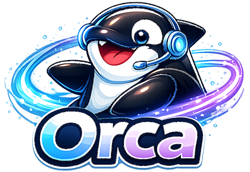
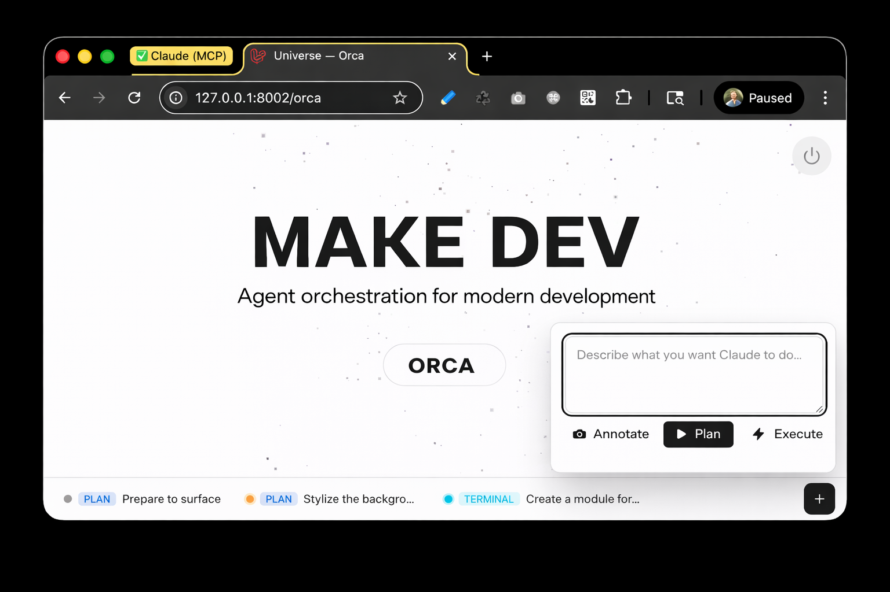
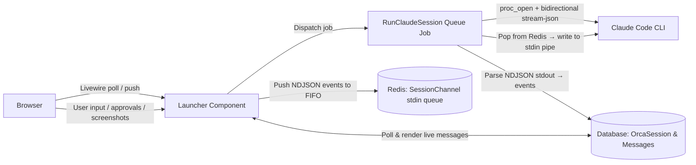

<p align="center">
  
</p>

<p align="center">
  <strong>Agent Orchestration in your web app.</strong>
</p>

<p align="center">
Bring Claude Code into your Laravel app — no terminal hopping, no context copying.
Orca turns every page into a live coding session: full page awareness, screenshots on demand, plan-then-execute safety, and seamless pop-out to macOS Terminal.
</p>
<p align="center">
Local-only. 🪄 Zero cloud middleman. 🧙🏻‍♀️ Pure dev magic. 🔮
</p>


<p align="center">

[](https://php.net)
[](https://laravel.com)
[](https://livewire.laravel.com)
[](https://docs.anthropic.com/en/docs/claude-code)
[](#pop-out-to-terminal)

</p>



## What is Orca? 🐋

Orca is a dev-friendly front-end widget that injects into every page of your app, letting you launch Claude Code sessions directly from the browser. It automatically captures context about the page you're looking at — the URL, route, controller or Livewire component, and authenticated user — and feeds it all to Claude.

No JavaScript framework required. Pure PHP and Livewire with real-time streaming output, bidirectional communication via Claude's `stream-json` protocol, and full permission control — all without leaving your app.

## Quick Start

```bash
composer require make-dev/orca
php artisan migrate
```
That's it. Orca auto-injects into every page in local environments — CSS and JS are served automatically.

## Features

- **In-Browser Claude Code** — Real-time streaming output. Watch Claude think, plan, and code live.

- **Plan / Execute Workflow** — Launch in Plan mode (read-only, safe by default) then upgrade to Execute mode with full permissions when the plan looks right.

- **Screenshot & Annotate** — Capture the current page, highlight elements, and attach screenshots to your prompts so Claude can see what you see.

- **Pop Out to Terminal** — Seamlessly hand off any session to native macOS Terminal for full interactive use. When you're done, Orca auto-resumes the session back in the browser.

- **Page-Aware Context** — Every session automatically captures the source URL, resolved route/controller/Livewire component, route name, and authenticated user.

- **Auto-Login URLs** — Generates Claude-friendly signed URLs so Claude can browse your app as the current user, with configurable expiry.

- **Session Management** — Taskbar UI with session pills, live status indicators, message history, parent/child session chaining, and bulk cleanup.

## How It Works

Orca bridges your browser to your agent using Laravel queues, Livewire, optionally Redis, and a custom event parser — all running locally on your machine.



1. The **Launcher** Livewire component dispatches a `RunClaudeSession` queue job with the user's prompt
2. The job spawns Claude CLI via `proc_open` using `--output-format stream-json` and `--input-format stream-json`
3. Claude's NDJSON stdout is parsed by `ClaudeEventParser` and stored as `OrcaSessionMessage` records
4. The Livewire component polls the database and renders messages in real time
5. User responses (text, permissions, screenshots) are pushed to a Redis FIFO queue (`SessionChannel`) and delivered to Claude's stdin pipe by the job loop

## Installation

```bash
composer require make-dev/orca
php artisan migrate
```
That's it. Orca auto-injects into every page in local environments — CSS and JS are served automatically. No asset publishing or Tailwind configuration required.

### Publish Configuration (optional)

```bash
php artisan vendor:publish --tag=orca-config
```

### Publish Views (optional)

```bash
php artisan vendor:publish --tag=orca-views
```

### Running

```bash
# Start a queue worker (required for session processing)
# --timeout=0 is critical — Claude sessions can run for minutes
php artisan queue:work --timeout=0

# Ensure Claude Code CLI is installed
claude --version
```

Orca automatically injects itself into every HTML response via middleware — no Blade changes needed. It only activates in the **local environment** (`app()->isLocal()`), so it will never appear in production.

## Configuration

Configuration can be published to `config/orca.php` and overridden via environment variables:

### General

| Variable | Default | Description |
|---|---|---|
| `ORCA_ENABLED` | `true` | Enable/disable the Orca widget entirely |
| `ORCA_TIMEOUT` | `300` | Default session timeout (seconds) |
| `ORCA_QUEUE` | `default` | Queue name for Orca jobs |

### Claude CLI

| Variable | Default | Description |
|---|---|---|
| `CLAUDE_BINARY` | `claude` | Path to the Claude Code CLI binary |
| `CLAUDE_PERMISSION_MODE` | `plan` | Default permission mode (`plan`, `acceptEdits`, `bypassPermissions`) |
| `CLAUDE_MAX_TURNS` | `50` | Maximum agentic turns per session |
| `CLAUDE_TIMEOUT` | `3600` | Claude process timeout (seconds) |

### Pop Out to Terminal

| Variable | Default | Description |
|---|---|---|
| `ORCA_POPOUT_ENABLED` | `true` | Enable the Pop Out to Terminal feature (macOS only) |

> **Screen Recording permission required for live preview:** The pop-out terminal feature shows a live screenshot preview of the Terminal window in the Orca widget. This requires **Terminal.app** to have Screen Recording permission. Grant it in **System Settings → Privacy & Security → Screen & System Audio Recording → Terminal**. Without this permission, screenshots will be blank and the widget will show a fallback "Running in Terminal" indicator instead.

### Auto-Login

| Variable | Default | Description |
|---|---|---|
| `ORCA_AUTO_LOGIN_ENABLED` | `true` | Enable signed auto-login URLs for Claude |
| `ORCA_AUTO_LOGIN_EXPIRY` | `30` | Auto-login URL expiry (minutes) |

### Screenshots

| Variable | Default | Description |
|---|---|---|
| `ORCA_SCREENSHOT_DISK` | `local` | Filesystem disk for screenshot storage |

### Redis

| Variable | Default | Description |
|---|---|---|
| `ORCA_REDIS_CONNECTION` | `default` | Redis connection for the stdin channel |
| `ORCA_REDIS_TTL` | `7200` | TTL for Redis stdin keys (seconds) |

## Usage

### Three Launch Modes

**Plan** (default) — Claude can read and explore your codebase but cannot write files or execute commands without permission. When Claude has a plan ready, click **Execute** to resume with full permissions.

**Execute** — Full permissions from the start. Use when you know exactly what you want and trust Claude to make changes immediately. Runs with `--dangerously-skip-permissions`.

**Terminal** — Opens Claude in native macOS Terminal for full interactive use. When the terminal session ends, Orca automatically resumes the session back in the browser so you can continue the conversation.

### Responding to Claude

When Claude asks a question or requests permission to use a tool, the session status changes to **Awaiting Input**. You can:

- **Type a response** in the input field and send it
- **Approve** or **Deny** tool permission requests with dedicated buttons
- **Attach a screenshot** to your response so Claude can see what you're referring to

### Screenshot Annotation

Click the screenshot button to capture the current page. The capture uses html2canvas to render the page, and the resulting image is attached to your prompt. Claude can read the screenshot file directly to understand the visual context of your request.

## Security

- **Local only** — The `InjectLauncher` middleware checks `app()->isLocal()` and refuses to inject in any other environment.
- **Signed URLs** — Auto-login uses Laravel's `URL::temporarySignedRoute()` with configurable expiry (default 30 minutes).
- **Permission modes** — Plan mode prevents unintended writes. Execute mode requires explicit user action.
- **Local execution** — Claude CLI runs locally on your machine. No data leaves the machine beyond what Claude Code itself sends to the API.

## Contributing

PRs and issues are welcome. Please follow Laravel conventions and include tests with any changes.

## License

MIT + Commons Clause

Free to use, modify, and distribute — but you may not sell Orca itself as a competing commercial product. See [LICENSE](LICENSE) for details.
